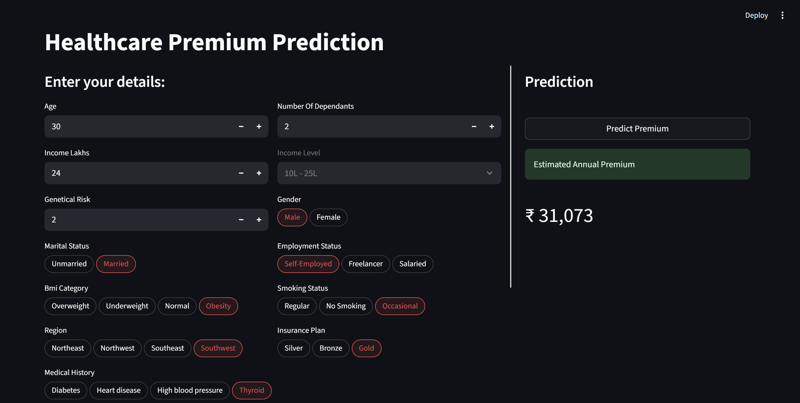
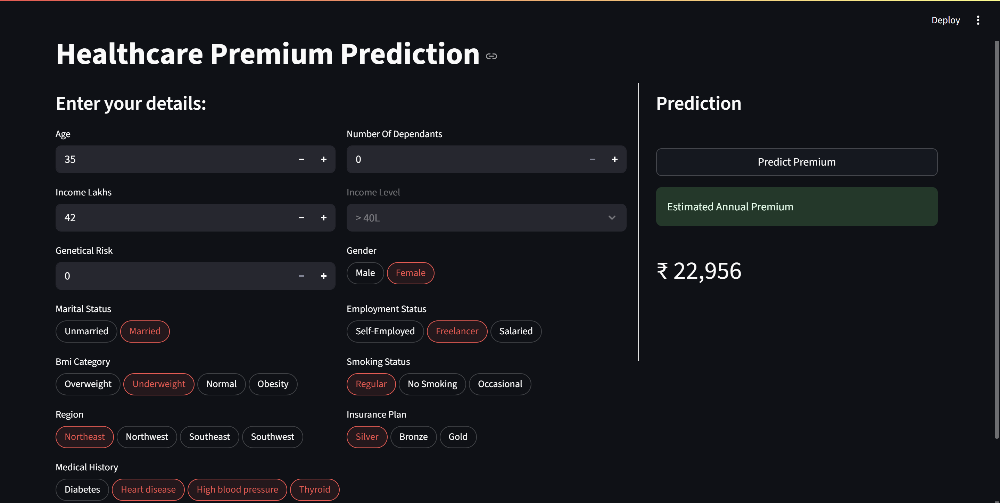

# Healthcare Premium Prediction

A machine learning web application that predicts annual healthcare insurance premiums based on personal, financial, and medical characteristics. Built with XGBoost and deployed via Streamlit.

## Live Demo

🔗 [Try the app on Streamlit Cloud](#) <!-- Add your Streamlit Cloud URL here -->

## Screenshot

<!-- Add screenshot here -->




---

## Overview

Insurance premium pricing depends on a combination of demographic, lifestyle, and medical factors. This project trains regression models to predict annual premium amounts and exposes them through an interactive web interface.

A key finding during development was that **young adults (age ≤ 25) require a separate model** — their premiums are driven primarily by genetic risk rather than developed medical conditions, which is the dominant factor for older adults. A dedicated dataset including a `genetical_risk` feature was sourced for this cohort, which brought model accuracy from R² ≈ 0.56 up to R² ≈ 0.998.

---

## ML Approach

### Age-Stratified Models

| Cohort | Condition | Training Records | Model |
|---|---|---|---|
| Young | Age ≤ 25 | ~20,000 | XGBoost (`model_young`) |
| Rest | Age > 25 | ~30,000 | XGBoost (`model_rest`) |

### Feature Engineering

- **Medical Risk Score** — each condition is assigned a domain-informed risk score (Heart disease: 8, Diabetes: 6, High blood pressure: 6, Thyroid: 5), summed across all selected conditions and min-max normalized to `normalized_risk_score`
- **Income Level** — derived from continuous `income_lakhs` into 4 buckets (`<10L`, `10L–25L`, `25L–40L`, `>40L`) to capture non-linear income effects
- **Insurance Plan** — ordinal encoding: Bronze → 1, Silver → 2, Gold → 3
- **One-hot encoding** — applied to gender, region, marital status, BMI category, smoking status, and employment status

### Model Performance

| Metric | Young Model | Rest Model |
|---|---|---|
| Train R² | ~0.998 | ~0.999 |
| Test R² | ~0.998 | ~0.998 |

Baseline linear regression achieved ~0.95 R² on the rest cohort and ~0.56 on the young cohort before the genetical risk feature was introduced.

---

## Input Features

| Feature | Type | Description |
|---|---|---|
| Age | Numerical | 18 – 100 |
| Number of Dependants | Numerical | 0 – 20 |
| Income (Lakhs) | Numerical | Annual income in ₹ lakhs |
| Genetical Risk | Numerical | Inherited risk score (0 – 5) |
| Gender | Categorical | Male / Female |
| Region | Categorical | Northeast, Northwest, Southeast, Southwest |
| Marital Status | Categorical | Married / Unmarried |
| BMI Category | Categorical | Normal, Overweight, Underweight, Obesity |
| Smoking Status | Categorical | No Smoking, Occasional, Regular |
| Employment Status | Categorical | Salaried, Self-Employed, Freelancer |
| Insurance Plan | Categorical | Bronze, Silver, Gold |
| Medical History | Multi-select | Diabetes, Heart disease, High blood pressure, Thyroid |
| Income Level | Auto-derived | Calculated from Income (Lakhs), read-only |

---

## Project Structure

```
ml-project-healthcare-premium/
├── streamlit-app/
│   ├── main.py                 # App layout and orchestration
│   ├── config.py               # Field definitions and options
│   ├── ui_components.py        # Reusable UI rendering functions
│   ├── prediction_helper.py    # Preprocessing and prediction pipeline
│   ├── requirements.txt        # Python dependencies
│   └── artifacts/
│       ├── model_young.joblib
│       ├── model_rest.joblib
│       ├── scaler_young.joblib
│       └── scaler_rest.joblib
├── Notebooks/
│   ├── premium_prediction.ipynb               # Initial full-dataset model
│   ├── split_dataset.ipynb                    # Age-based dataset split
│   ├── premium_prediction_young.ipynb         # Young cohort (first attempt)
│   ├── premium_prediction_young_with_gr.ipynb # Young cohort with genetical risk
│   ├── premium_prediction_rest.ipynb          # Rest cohort model
│   └── premium_prediction_rest_with_gr.ipynb  # Rest cohort final model
├── .python-version
└── README.md
```

---

## Tech Stack

| Layer | Technology |
|---|---|
| Modelling | XGBoost, scikit-learn |
| Data | pandas, NumPy |
| Serialization | joblib |
| Web App | Streamlit 1.48 |
| Python | 3.12 |

---

## Running Locally

**Prerequisites:** Python 3.12 and `git` installed.

**1. Clone the repository**
```bash
git clone https://github.com/ahmadfahim2k/ml-project-healthcare-premium.git
cd ml-project-healthcare-premium
```

**2. Create and activate a virtual environment** *(recommended)*
```bash
# Windows
python -m venv venv
venv\Scripts\activate

# macOS / Linux
python -m venv venv
source venv/bin/activate
```

**3. Install dependencies**
```bash
cd streamlit-app
pip install -r requirements.txt
```

**4. Run the app**
```bash
streamlit run main.py
```

The app will open automatically in your browser at `http://localhost:8501`.
